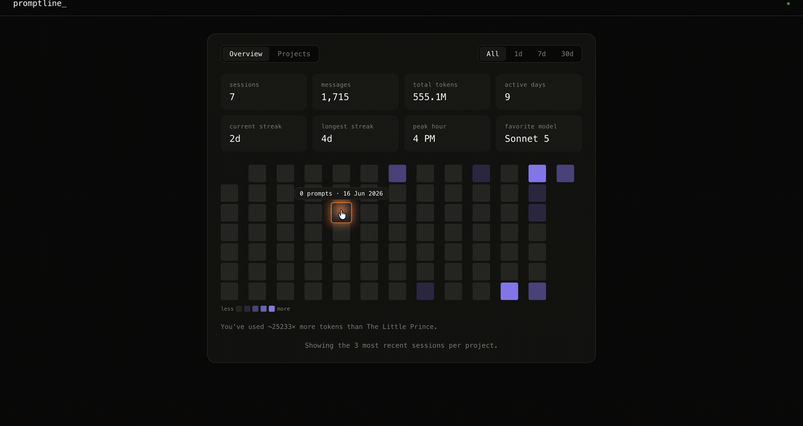

# Promptline

A local, read-only visual timeline of everything you've typed into Claude
Code, reconstructed from your own session logs so you can recover context
you've forgotten across projects and sessions.



Fully local: reads `~/.claude/projects/`, binds to `127.0.0.1` only, makes
no outbound network calls, never writes anything back. Stdlib Python only
— no dependencies, no build step.

Claude Code deletes session logs after 30 days by default, so that's the
practical history window here too. To keep logs longer, raise
`cleanupPeriodDays` in your Claude Code `settings.json`.

## Running it

```bash
python3 server.py
```

Then open http://127.0.0.1:8787. Useful flags: `--dir`, `--port`,
`--max-sessions-per-project` (default 3, so old history doesn't flood the
UI — nothing on disk is touched).

Or install it as a Claude Code plugin and run it from inside a session:

```
/plugin marketplace add zzunaid/prompt-line
/plugin install promptline@promptline
/reload-plugins
```

`/reload-plugins` requires Claude Code v2.1.221+; on older versions it
won't be recognized as a command — just fully quit and restart Claude Code
instead, which has the same effect.

Then `/promptline:dashboard` any time to start it and get the URL.

### Updating

If installed via a direct clone, `git pull` picks up changes immediately.
If installed as a plugin, updates are pull-based — Claude Code won't notify
you that a new version exists. Check periodically with:

```
/plugin marketplace update promptline
/plugin update promptline@promptline
/reload-plugins
```

## What it does

- **Overview**: session/message/token stats, streaks, peak hour, favorite
  model, and a GitHub-style activity heatmap. Click a day to see exactly
  what you typed.
- **Projects**: the same stats broken down per project, click-through to
  that project's prompts.
- **All / 1d / 7d / 30d** scopes everything to a time window.
- Drilling into a day or project opens a searchable, chronological feed of
  your actual prompts and Claude's responses (responses collapse by
  default, click "show response"), with a copy button for handing a past
  exchange back to a new conversation as context.

### Why not just CLAUDE.md / auto memory?

Claude Code only carries knowledge across sessions through CLAUDE.md
(instructions you write) and auto memory (notes Claude writes itself) —
everything else in a closed session's context is gone once that session
ends. Promptline doesn't replace either of those or automate memory the
way a tool like [claude-mem](https://github.com/thedotmack/claude-mem)
does; it's the retrieval half of that workflow — a way to find what you
actually said in a past session so you can explicitly paste it into a new
one or promote it into a CLAUDE.md yourself.

## Files

```
server.py                     thin shim - delegates to plugins/promptline/server.py,
                               so `python3 server.py` keeps working from the repo root
.claude-plugin/
  marketplace.json            lets this repo be added via /plugin marketplace add
plugins/promptline/
  .claude-plugin/plugin.json  plugin manifest
  skills/dashboard/SKILL.md   the /promptline:dashboard command
  server.py                   the real implementation: stdlib HTTP server,
                               /api/data, /api/stream (SSE), static files
  parser.py                   JSONL -> prompt/response entries
  static/
    index.html                page shell
    style.css                 styling
    app.js                    view/sort/search/filter logic, SSE client
```

See [docs/notes.md](docs/notes.md) for how the log parsing and live-update
mechanism actually work, and notes on developing against the plugin.
