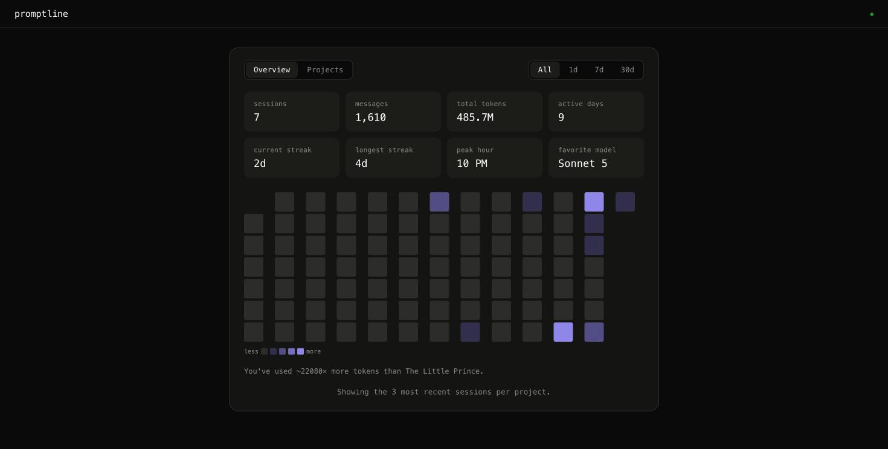

# Promptline

A local, read-only visual timeline of everything you've typed into Claude
Code, reconstructed from your own session logs so you can recover context
you've forgotten across projects and sessions.



## How it works

Claude Code writes one JSONL file per session under `~/.claude/projects/`.
Promptline scans that tree, keeps a parsed copy in memory, and serves a web
UI over it. It watches for changes (new prompts as you work) and pushes live
updates to any open browser tab.

**Stack:** Python 3, standard library only — `http.server`, `threading`,
`json`, `pathlib`. No `pip install`, no npm, no build step. The frontend is
plain HTML/CSS/JS with no CDN references; everything is served from this
repo. Live updates use Server-Sent Events (`EventSource`), which needs zero
extra code on either end, instead of WebSockets, which Python's stdlib
doesn't provide a server for.

**The one tradeoff:** there's no OS-level file watching (no `inotify`) in
the standard library, so a background thread polls file modification times
every ~2 seconds. When a file changes, the server reparses just that file
and tells connected browsers "something changed" over SSE; the browser then
re-fetches the full dataset. That means new prompts can take up to ~2
seconds to appear, and each refresh re-sends the whole dataset rather than
just the diff — both fine tradeoffs for a personal, local tool, in exchange
for a watcher simple enough to trust and zero dependencies to install.

## Privacy / safety

- Binds only to `127.0.0.1` — never reachable from your network.
- Makes no outbound network calls of any kind.
- Only *reads* files under `~/.claude/projects/`; never writes, moves, or
  deletes anything there.
- Nothing is sent anywhere: everything happens in your browser and this one
  local process.

## Running it

Requires Python 3.7+ (uses only the standard library — nothing to install).

```bash
python3 server.py
```

Then open http://127.0.0.1:8787 in your browser.

By default it watches `~/.claude/projects`. Override with:

```bash
python3 server.py --dir /path/to/other/projects --port 9000
```

By default it only loads the **3 most recent sessions per project**, so a
project with months of history doesn't flood the UI (or memory) with old
sessions. Override with:

```bash
python3 server.py --max-sessions-per-project 10
```

This only limits what's loaded into the app — nothing on disk is touched,
and a session that starts getting new prompts again re-enters the window on
the next poll.

Stop it with `Ctrl+C`.

### Installing as a Claude Code plugin

This repo also works as its own Claude Code plugin marketplace, so you can
launch the dashboard from inside a Claude Code session instead of a
terminal:

```
/plugin marketplace add zzunaid/prompt-line
/plugin install promptline@promptline
/reload-plugins
```

Then run `/promptline:dashboard` any time to start the server in the
background and get the URL to open. The plugin bundles the exact same code
as running `python3 server.py` directly — see [Files](#files) below for
where it actually lives.

**If you're developing on this repo:** installing the plugin copies its
code into `~/.claude/plugins/cache/promptline/promptline/<version>/` - a
separate snapshot, not a live link back to your clone. Editing files here
won't affect what `/promptline:dashboard` runs until you bump the version
in `plugins/promptline/.claude-plugin/plugin.json` and reinstall. While
iterating, just run `python3 server.py` directly from your working copy
instead. Both point at the same `~/.claude/projects/` by default, so either
one shows the same data - it's only the *code* that's a separate copy.

## Using it

- **Overview** is the default view: stat tiles (sessions, messages, total
  tokens, active days, current/longest streak, peak hour, favorite model),
  a GitHub-style activity heatmap, and a token comparison against *The
  Little Prince* for scale. Click any day in the heatmap to drill into that
  day's prompts.
- **Projects** breaks the same stats down per project (working directory),
  each with its own session/message/token/model summary and a "last active"
  timestamp. Click a project to drill into its prompts.
- **All / 1d / 7d / 30d** in the top-right scopes every stat and the heatmap
  to that window.
- Drilling into a day or project opens a flat, chronological prompt feed —
  a small vertical rail with one dot per prompt, "you" / "claude" for each
  turn. From there: **Newest / Oldest** sort, a **search box** across both
  prompts and responses, the active date filter (clearable), and a project
  dropdown to pivot to a different project without going back. There's no
  separate top-level "Timeline" tab — this feed is only reached by drilling
  in from Overview or Projects.
- Every prompt has a **copy** button that puts that exchange (prompt +
  response) on your clipboard as plain text, ready to paste into a new
  Claude conversation for context. The **copy transcript** button in the
  feed's toolbar does the same for everything currently visible — respecting
  whatever search/date/project filter is active — so you can hand off a
  whole day or project's worth of history at once.
- Long prompts/responses truncate to a few lines with a "more" toggle, so
  scanning a long history doesn't mean scrolling past walls of text.
- A green dot in the header means the live-update connection is active; it
  greys out if the connection drops (e.g. you closed your laptop lid).

## Files

```
server.py                     thin shim - delegates to plugins/promptline/server.py,
                               so `python3 server.py` keeps working from the repo root
.claude-plugin/
  marketplace.json            lets this repo be added via /plugin marketplace add
plugins/promptline/
  .claude-plugin/plugin.json  plugin manifest
  skills/dashboard/SKILL.md   the /promptline:dashboard command
  server.py                   the real implementation: stdlib HTTP server,
                               /api/data, /api/stream (SSE), static files
  parser.py                   JSONL -> prompt/response entries
  static/
    index.html                page shell
    style.css                 styling
    app.js                    view/sort/search/filter logic, SSE client
```

## Notes on the log format

Claude Code's JSONL schema isn't officially documented, so this was built
by reading real log files directly:

- Genuine typed prompts are `"type": "user"` lines whose `message.content`
  is a plain string. Lines where `message.content` is a list of
  `tool_result` blocks are the tool-output echoes the CLI also logs as
  "user" turns — those are filtered out, since they're not something you
  typed.
- Claude's replies are spread across multiple `"type": "assistant"` lines
  (thinking / text / tool-use blocks are logged separately); Promptline
  concatenates the `text` blocks between one prompt and the next to
  reconstruct the reply shown to you.
- The project directory comes from the `cwd` field logged on each line, not
  from decoding the `~/.claude/projects/<encoded-path>/` folder name (that
  encoding is ambiguous for paths containing dashes).
- Subagent-internal messages (`"isSidechain": true`) are excluded — this is
  a timeline of what *you* typed, not what background agents said to each
  other.
- Any line that fails to parse as JSON, or has an unexpected shape, is
  skipped rather than crashing the parse.
- Token/model stats come from `message.model` and `message.usage` on
  `"assistant"` lines. Both repeat on every content-block line that shares
  a message id (thinking/text/tool-use are logged as separate lines of the
  same message), so each is counted once per unique id. "Total tokens" sums
  input, output, cache-creation, and cache-read tokens across those
  messages — it's cumulative usage, not distinct content, so cache-heavy
  sessions can look large.
- Typing a slash command (e.g. `/promptline:dashboard`) doesn't log as that
  literal text - Claude Code wraps it in `<command-name>`/`<command-args>`
  tags, which get reconstructed back into the plain command you typed.
- Not everything logged as a `"user"` turn was actually typed: synthetic
  context Claude Code injects into the conversation (`"isMeta": true`,
  e.g. a skill's own instruction body) and system-fired turns
  (`"promptSource": "system"` - task-notifications, scheduled wakeups) are
  excluded from the timeline the same way sidechain messages are.
